# Lab 4 WebSocket -- Project Report

**Author:** Ariana Porroche Llorén (874055)

**Date:** 5th November 2025

**Course:** Web Engineering

## Description of Changes

During this lab, I implemented and verified WebSocket-based communication for the ELIZA chatbot server.
Initially, I completed the required task by finalizing the `ElizaServerTest.kt` tests to ensure the server correctly handled `onOpen` and `onChat` events, verifying both the greeting and DOCTOR-style responses.

I tried to interact with the Eliza Server via Postman, connecting to `ws://localhost:8080/eliza`, as in the following image:

| Postman initial tests |
|-----------|
| 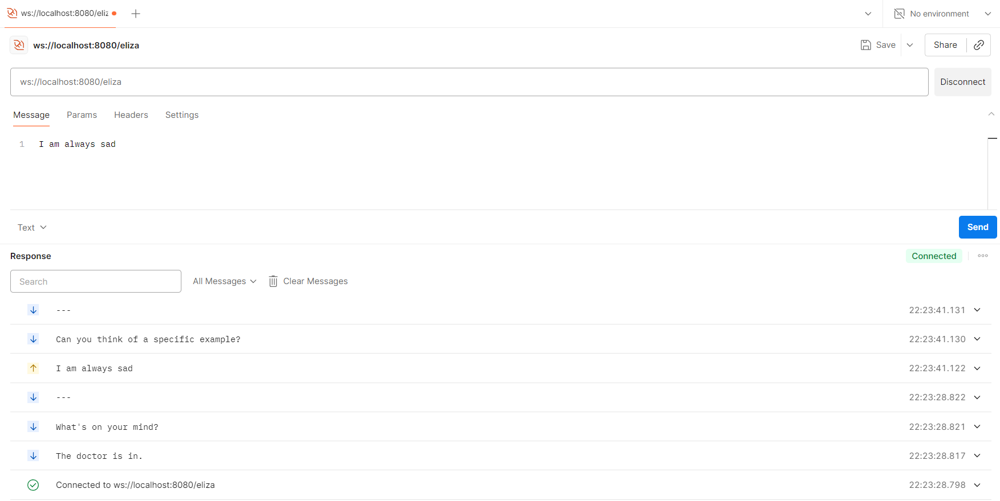 |

Additionally, I extended the project with two optional enhancements:

### 5. Real-time Analytics Dashboard:
  - **Description:**
  Implemented a new `/analytics` WebSocket endpoint to broadcast live server statistics such as: `activeElizaClients`, `analyticsConnectionsEver`, `clientsDisconnected`, `messagesReceived`, `messagesSent`, and `lastMessage`.
  - **Implementation:**
  Added the `AnalyticsEndpoint` class to manage metrics and send real-time JSON updates to all connected analytics clients. Additionally, created a simple front-end page, dashboard.html, available at `http://localhost:8080/dashboard.html`, which visually displays these analytics using a live WebSocket connection.
  - **Functionality:**
  The dashboard connects via WebSocket to `ws://localhost:8080/analytics`, automatically updating the displayed metrics and showing the latest message sent through the ELIZA chat.
  - **Testing:**
  Functionality was verified using the integration test file `AnalyticsIntegrationTest.kt`, simulating multiple clients and message exchanges. Manual verification was also done via `Postman` to ensure metrics updated correctly and messages were reflected in real time.

| Postman analytics test at ws://localhost:8080/analytics |
|-----------|
| 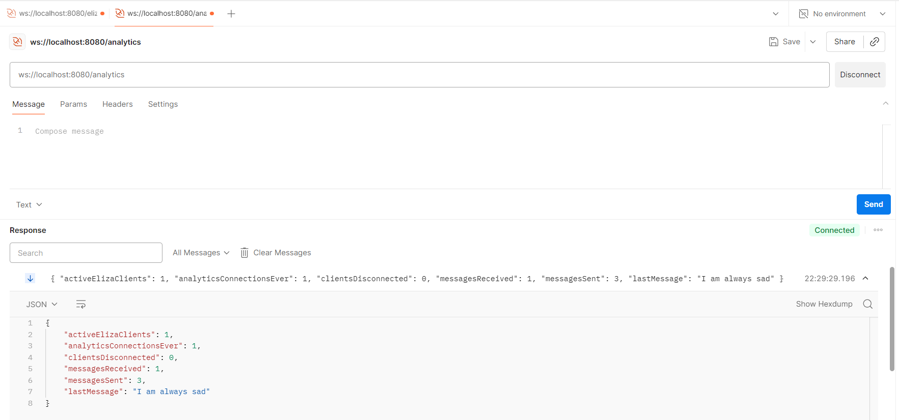 |

| Initial Dashboard | Dashboard with 1 eliza client | Dashboard with 2 eliza clients |
|-----------|-----------|-----------|
| 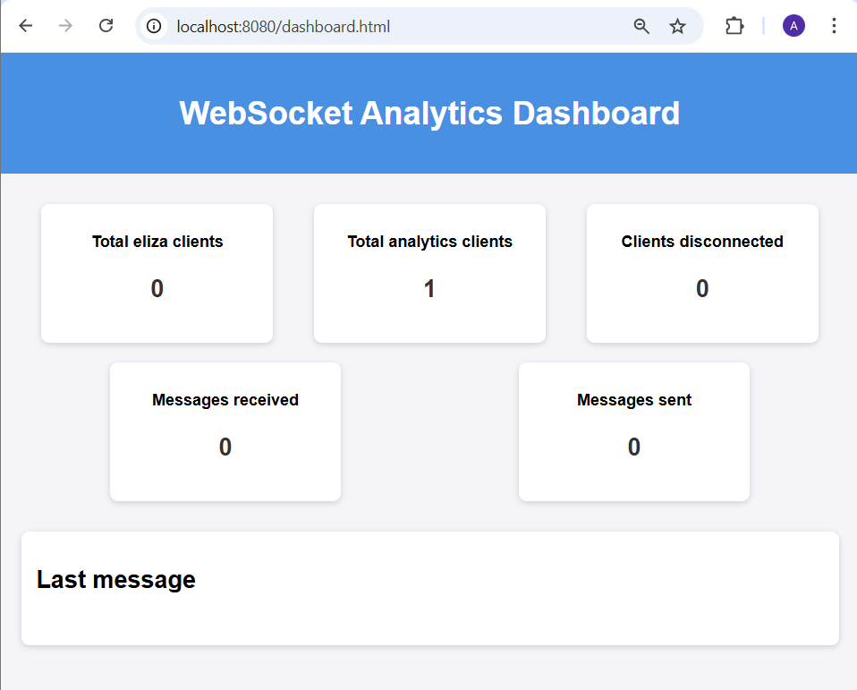 | 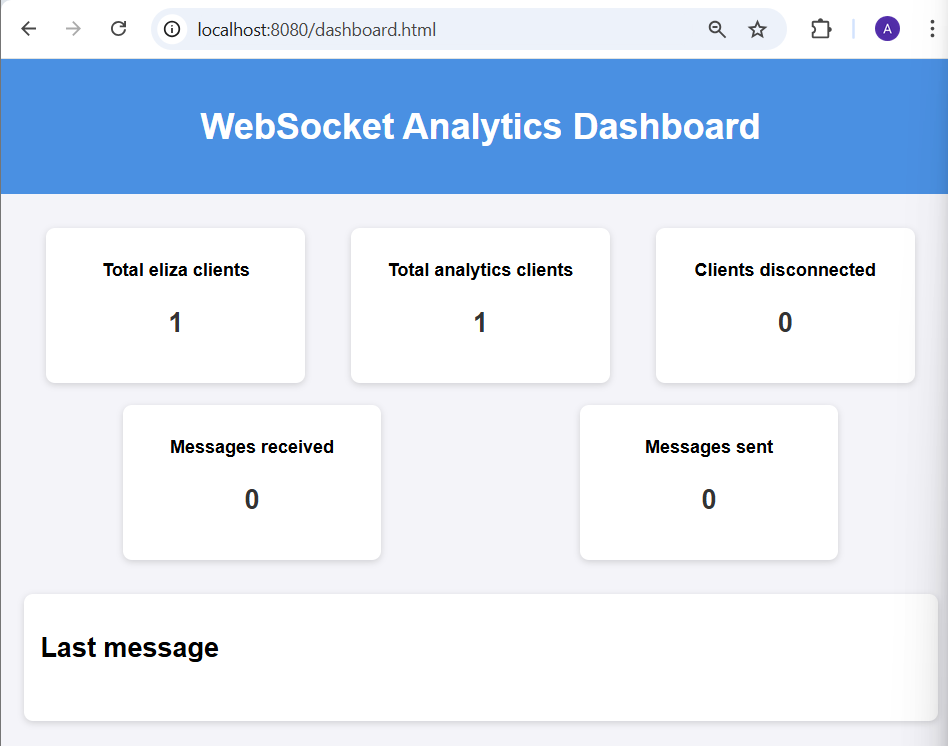 | 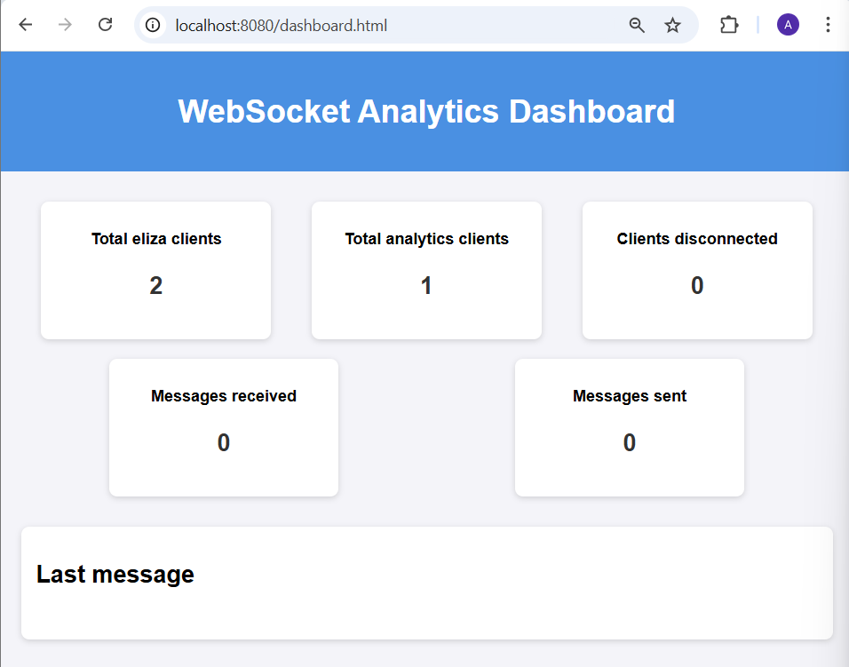 |

| Dashboard when client has sent 1 message | Dashboard when client has sent 2 messages |
|-----------|-----------|
| 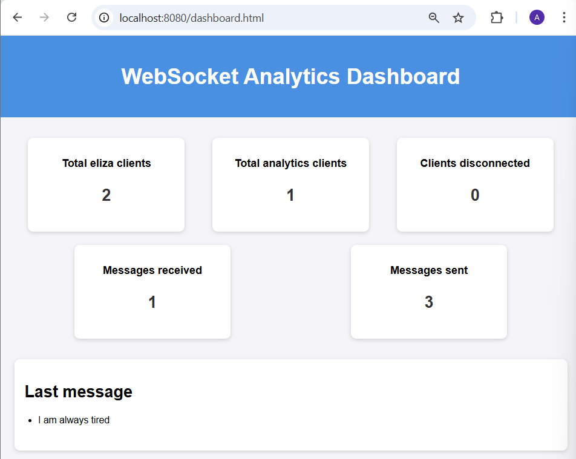 | 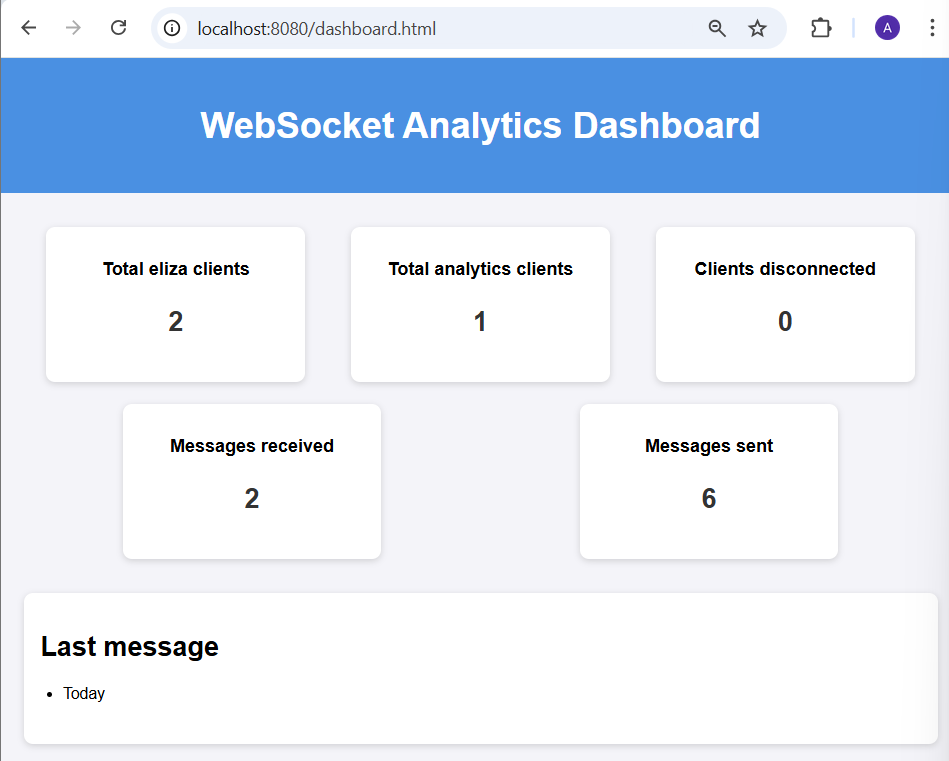 |

### 8. Session Management and Broadcast:
  - **Description:**
  Extended the `/eliza` WebSocket endpoint to maintain active sessions in memory using a `CopyOnWriteArraySet`. This allows the server to track all currently connected clients efficiently.
  - **Implementation:**
  Implemented a broadcast system that sends real-time updates to all connected clients whenever someone joins, leaves, or sends a message. Each message triggers analytics tracking to update metrics such as messages sent, messages received, and active clients.
  - **Functionality:**
  The server now keeps all clients synchronized by broadcasting chat activity and session changes, ensuring both the ELIZA clients and the analytics dashboard reflect the current state of active sessions.
  - **Testing:**
  Verified using `SessionsTest.kt`, simulating multiple concurrent clients. Confirmed that broadcasts reached all clients and analytics metrics updated correctly. Manual tests via `Postman` confirmed expected real-time behavior.

| Client 1 | Client 2 | Client 3 |
|-----------|-----------|-----------|
| 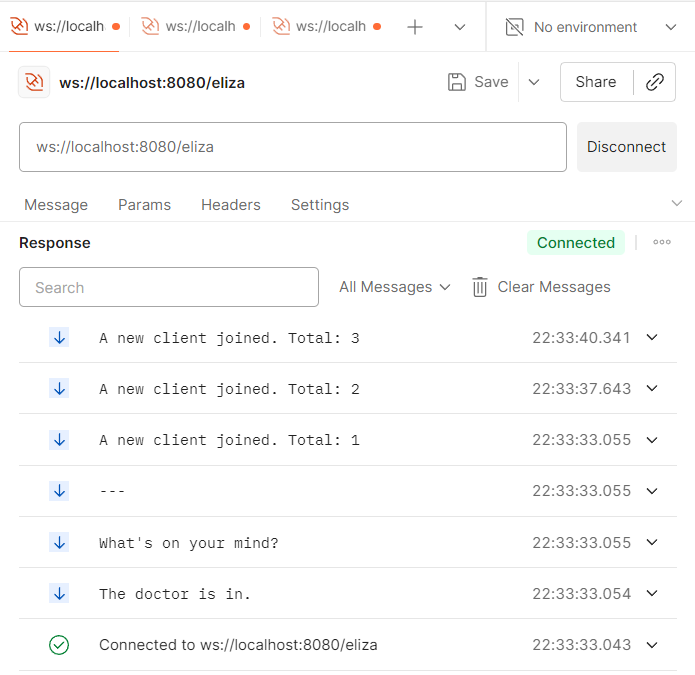 | 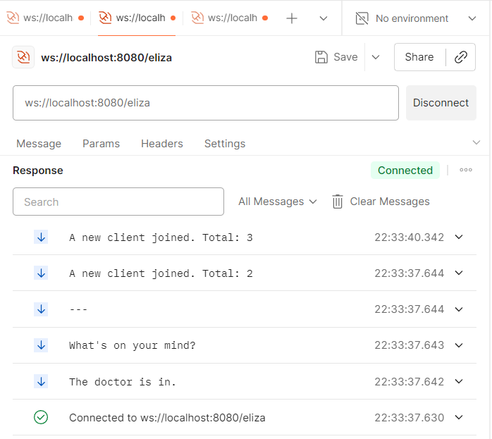 | 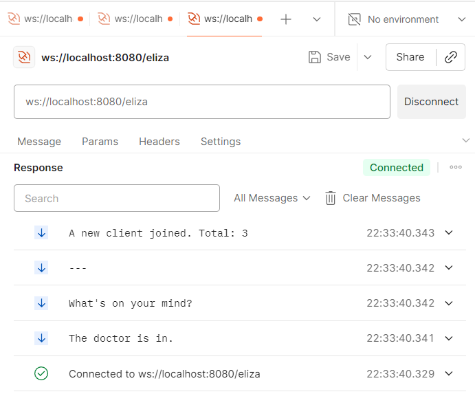 |

Next, I tested the scenario where Client 1 sends a message and the `ElizaServer` broadcasts it to all connected clients:

| Client 1 | Client 2 | Client 3 |
|-----------|-----------|-----------|
| 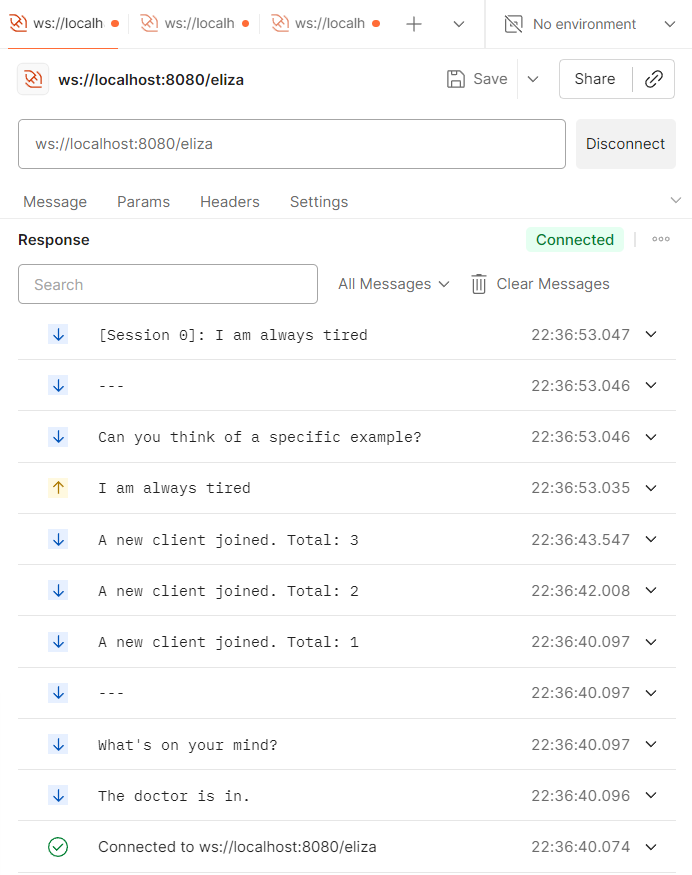 | 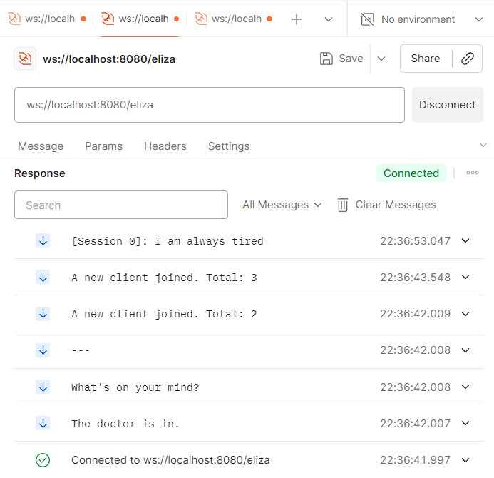 | 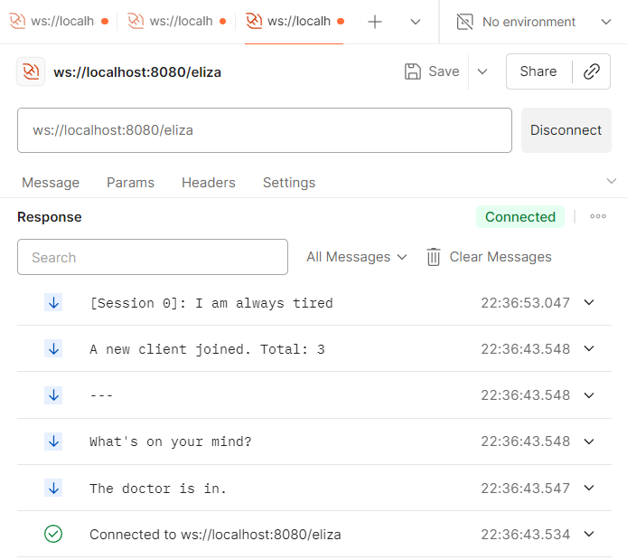 |

## Technical Decisions

- **Shared Singleton for Analytics:**
  I updated `AnalyticsEndpoint` to use a companion object instead of creating new instances per message. This ensures a consistent global state across all connections.
- **Thread Safety:**
  Used `CopyOnWriteArraySet` to safely handle multiple clients connecting and disconnecting at the same time.
- **Synchronized Sending:**
  Wrapped `sendText` calls in synchronized blocks (`sendTextSafe`) to avoid `IllegalStateException` when multiple messages are sent concurrently.
- **JSON Handling:**
  Used `kotlinx.serialization.json` utilities (`jsonObject`, `jsonPrimitive`) for structured parsing in integration tests, making it easier to read and verify the metrics.

## Learning Outcomes

Through this lab, I learned:
- How to design and manage WebSocket endpoints in a Spring Boot environment.
- The WebSocket lifecycle (connect, message, close) and how to broadcast messages between clients.
- Techniques for maintaining real-time analytics and shared state across endpoints.
- The importance of synchronization and concurrency control when handling multiple simultaneous WebSocket sessions.
- How to write integration tests for asynchronous WebSocket communication.

## AI Disclosure
### AI Tools Used

OpenAI ChatGPT (GPT-5) — used as a coding assistant.

### AI-Assisted Work

- Guidance and debugging help for WebSocket message synchronization and test failures.
- Suggestions for refactoring `AnalyticsEndpoint` to use a shared companion object.
- Minor help writing Markdown documentation (this project report).
- Estimated AI-assisted work: ~25%

### Original Work

- Full implementation of `AnalyticsEndpoint`, `ElizaEndpoint` modifications, and all integration tests were written and debugged manually.
- I independently analyzed test behavior, concurrency issues, and validated functionality with manual Postman testing.
- The learning process involved researching WebSocket lifecycle handling and synchronization best practices.
